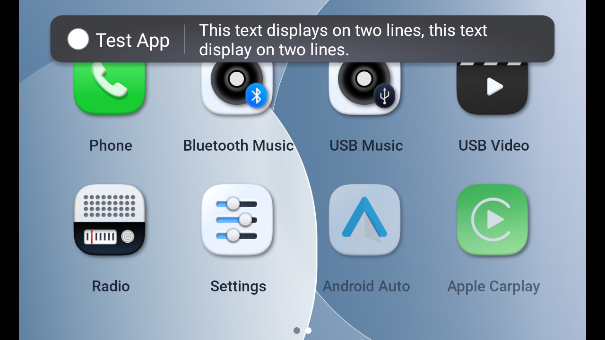

# NADA OSD popup

In current version, OSD popup only used by Android Auto and Apple Carplay

## Description

This is OSD popup for NADA

* the OSD popup with text and icon in one line


* the OSD popup with text and icon in two lines


* the OSD popup with text only in one line


* the OSD popup with text only in two lines


## Feature

- [x] OSD popup with text only
- [x] OSD popup with text and icon
- [x] OSD popup with customize view by app

## How to use

This popup is wraped Notification of Android framework. How to use: simillar to build a Notification in Android framework:

### Flash the latest sw 

* pull source code include commit implement notification (a80e5b0dc2c3ee36e757a1845694a75fd01ff45e)
* Go to root folder
* quick_rebuild and build_mkfaiimg
* Flash into board

### Import some neccessary packages

```java
    import android.app.NotificationChannel;
    import android.app.NotificationManager;
```

### Create channel

* Define some attribute of a channel
```java
    String  CHANNEL_ID              =       {channel_id}
    String  CHANNEL_NAME            =       {channel_name}
    int     CHANNEL_IMPORTANT       =       {channel_important}
    String  CHANNEL_DESCRIPTION     =       {channel_description}
```

* Create and active channel
```java
    NotificationChannel channel = new NotificationChannel(CHANNEL_ID, CHANNEL_NAME, CHANNEL_IMPORTANT);
    channel.setDescription(CHANNEL_DESCRIPTION);

    NotificationManager notificationManager = this.getSystemService(NotificationManager.class);
    notificationManager.createNotificationChannel(channel);
```

### Make a notification

* retrieve notification service by Android system
```java
    NotificationManager notificationManager = (NotificationManager) getSystemService(NOTIFICATION_SERVICE);
```

* create notification buider
```java
    NotificationCompat.Builder builder = new NotificationCompat.Builder(Context context, String channel_id);
```

* add atrribute to title and icon
    * if title attribute was set to non, both icon and title was not displayed
```java
    builder.setContentTitle(String title);              
    builder.setSmallIcon(int icon);             
```

* add atrribute to text
    * if the text was too long, it will display on two lines and resize the text a bit (from 40px to 35px)
```java
    builder.setContentText(String text);
```

* notify the notification
```java
    notificationManager.notify(int id, builder.build());
```

### Notification with remote view

* In case want to customize UI of OSD, should be include this view into the remote view and build with noti 
```java
    import android.app.NotificationManager;
    import android.widget.RemoteViews;

    NotificationManager notificationManager     =       (NotificationManager) getSystemService(NOTIFICATION_SERVICE);
    NotificationCompat.Builder builder          =       new NotificationCompat.Builder(Context context, String channel_id);
    
    builder.setSmallIcon(int icon);                         
    builder.setCustomContentView(RemoteView remoteViews);   

    notificationManager.notify(int id, builder.build());
```
